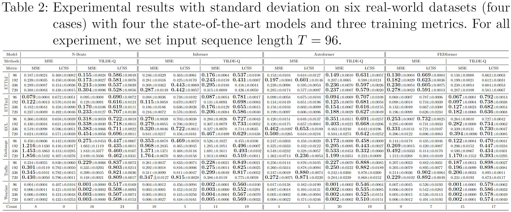
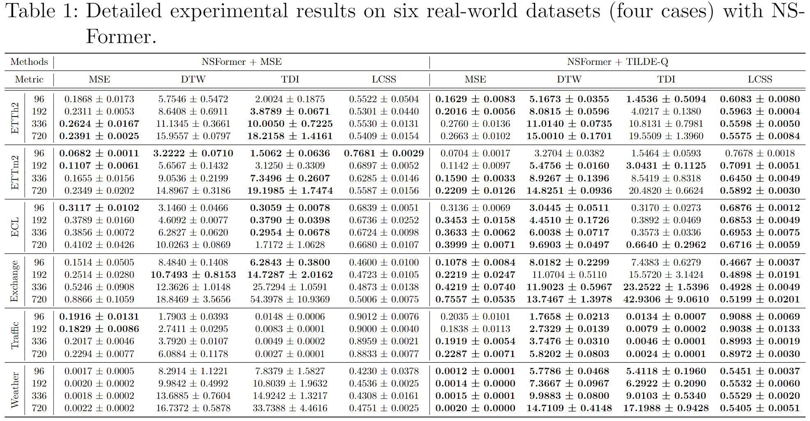
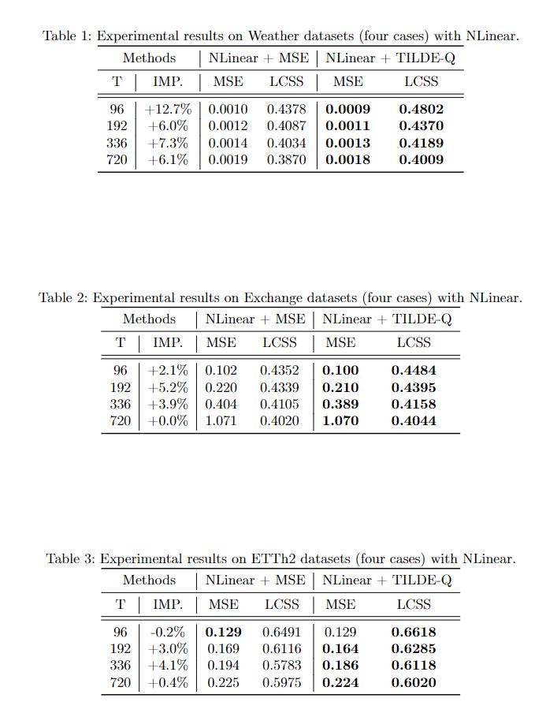
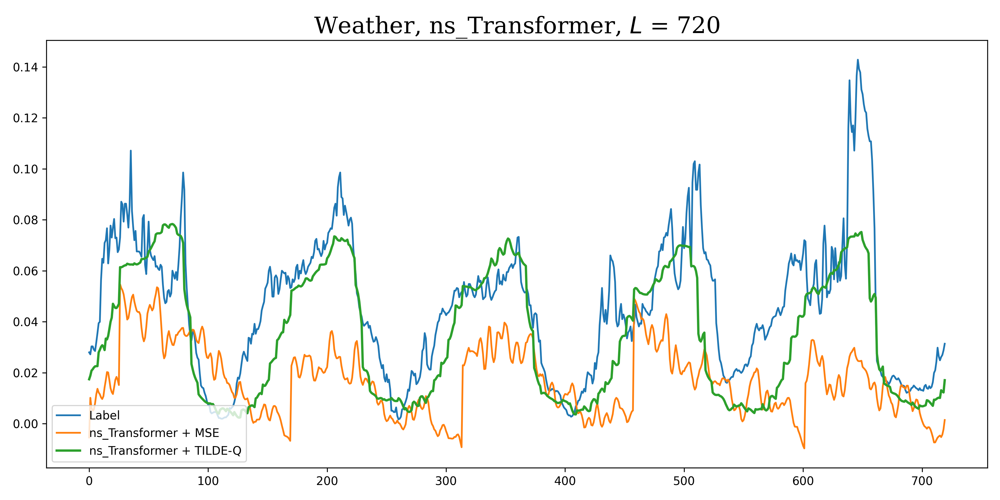

# TILDE-Q
Official Implementation of TILDE-Q: A Transformation Invariant Loss Function for Time-Series Forecasting

## Get Started

1. Install Python>=3.7, PyTorch>=1.9.0, and nbeats-pytorch.
2. Download data from Autoformer and other public repositories.
3. Go to the `src` folder and train the model. We provide scripts in `./src/TILDEQ_scripts`. You can reproduce our results by:

```
cd ./src
bash ./TILDEQ_scripts/run_univariate_model.sh GPU_ID TRAIN_METRIC MODEL
```
You can select `mse`(vanilla MSE), `dilate`(DILATE), or `tildeq`(TILDE-Q, ours) as `TRAIN_METRIC`.
In this repository, we support following models:

- [x] N-Beats
- [x] Transformer
- [x] Informer
- [x] Reformer
- [x] Autoformer
- [x] FEDformer
- [x] NSFormer

## Experimental Results
We experiment on six benchmark datasets with N-Beats, Informer, Autoformer, FEDformer and NSFormer. In this repository, we provide quantitative results of them trained with MSE and TILDE-Q as below.
TILDE-Q can significantly improve performance of state-of-the-art models, including NSFormer. Especially, in the Weather dataset, TILDE-Q successfully models the periodicity, which is hard to solve with existing metrics.








## Qualitative Examples
We additionally provide our qualitative examples with all the settings on six datasets and five models in `qualitative_results`. In the qualitative results, we provide comparison on three different training metrics -- MSE, DILATE, and TILDE-Q. To compare quantitative results of DILATE, please refer to our main paper.
Below is one example with Weather dataset, 96-Input-720-Output setting with NSFormer.


