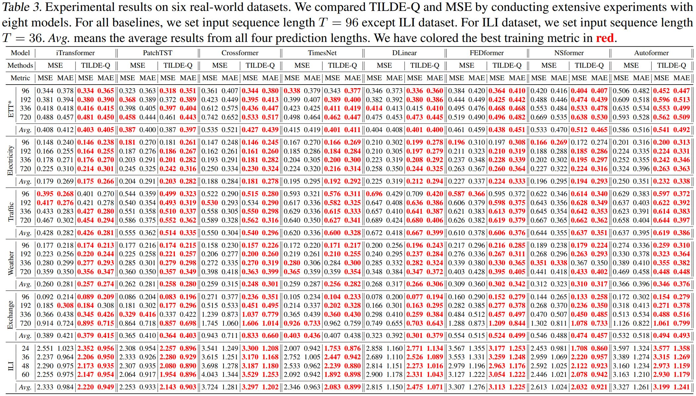
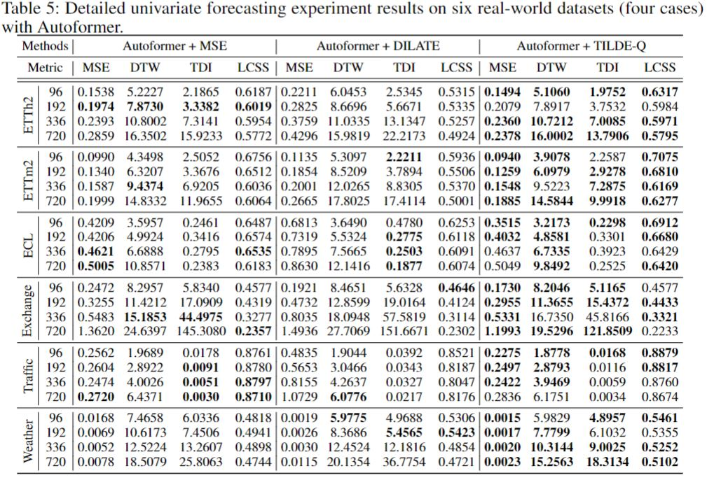
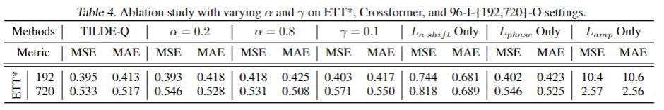
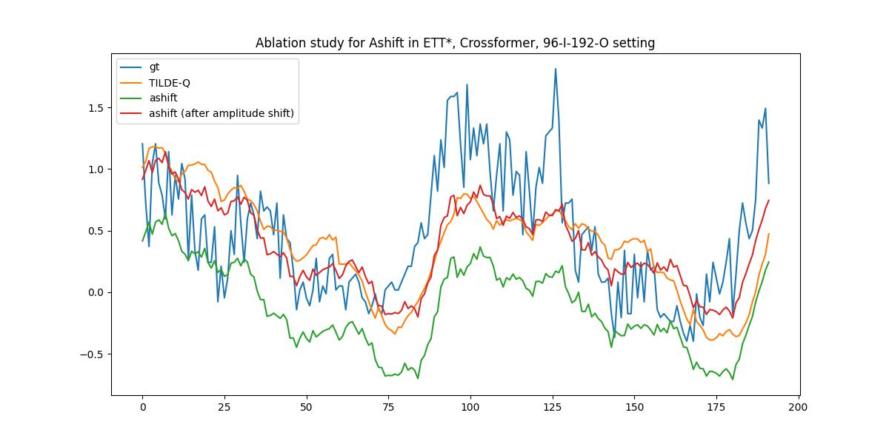
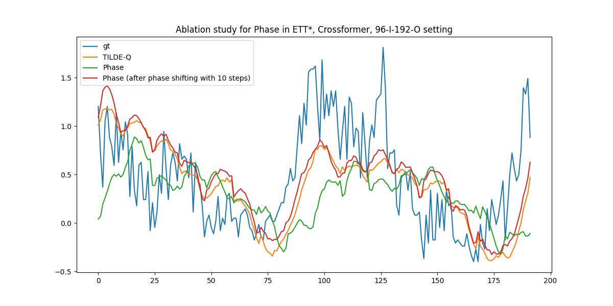
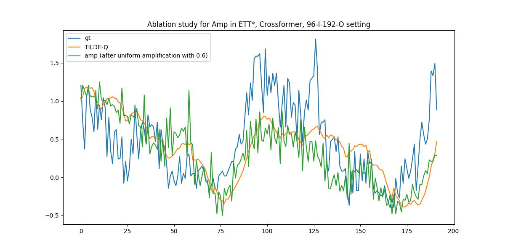

# TILDE-Q

This repository is an official Implementation of TILDE-Q: A Transformation Invariant Loss Function for Time-Series Forecasting. Deep learning models in this GitHub are referred from [Time-Series-Library GitHub](https://github.com/thuml/Time-Series-Library)

## Get Started

1. Install requirements via `pip install -r src/requirements.txt`.
2. Download data from Autoformer and other public repositories.
3. Go to the `src` folder and train the model. We provide scripts in `./src/TILDEQ_scripts`. You can reproduce our results by:

```
cd ./src
bash ./TILDEQ_scripts/{DATASET}_script/{MODELNAME}.sh
```

You can manually select hyperparameters related to the loss function by modifying the arguments of `run.py` as below:
```
python run.py --loss LOSS --gamma GAMMA --alpha ALPHA --test_loss TESTLOSS
```

For the detailed implementation, please check [Time-Series-Library GitHub](https://github.com/thuml/Time-Series-Library).
In this repository, we provide scripts for the following models:

- [x] Autoformer
- [x] FEDformer
- [x] NSformer
- [x] DLinear
- [x] Crossformer
- [x] PatchTST
- [x] TimesNet
- [x] iTransformer

### How to conduct experiment with dilate loss function

1. Clone loss function parts of [DILATE](https://github.com/vincent-leguen/DILATE) into the `src/loss`
2. Modify `_select_criterion` function in `src/exp_long_term_forecasting.py` accordingly
3. Run the experiment with `run.py ... --loss DILATE`

## Experimental Results
We experiment on six benchmark datasets with Autoformer, FEDformer, NSformer, DLinear, TimesNet, Crossformer, PatchTST, and iTransformer. In this repository, we provide quantitative results of those trained with MSE and TILDE-Q as below.
TILDE-Q can significantly improve the performance of state-of-the-art models, including iTransformer. Especially, in the Weather dataset, TILDE-Q successfully models the periodicity, which is hard to solve with existing metrics.



### Experimental Results with DILATE
We additionally provide experimental results with DILATE in univariate forecasting task. Please note that DILATE only supports univariate forecasting. We perform experiment with six benchmark dataset on Autoformer.




### Ablation Study Results
We have conducted an ablation study with varying hyperparameters and each sub-loss. Each experiment was performed three times and reported on average. As the table shows, TILDE-Q is not hyperparameter-sensitive except for the large gamma value on long-term or bursty data. Furthermore, visualization of the amplitude shift, phase shift, and uniform amplification loss functions implies two facts -- 1) each subloss could achieve invariance for corresponding distortion, and 2) all three sublosses complement each other to generate better forecasting performance in both shape-awareness and traditional metrics (i.e., MSE and MAE).










## Qualitative Examples
We additionally provide our qualitative examples with all the settings on six datasets and five models in `qualitative_results`. In the qualitative results, we provide comparison on three different training metrics -- MSE, DILATE, and TILDE-Q. To compare the quantitative results of DILATE, please refer to our main paper.
Below is one example with the Weather dataset, 96-Input-720-Output setting with NSFormer.


